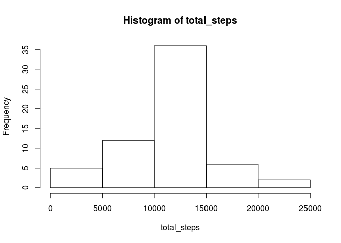

# Reproducible Research: Peer Assessment 1


## Loading and preprocessing the data


```r
library(readr)
library(magrittr)
library(plyr)
library(dplyr)
d <- read_csv("activity.csv")
```

```
## Parsed with column specification:
## cols(
##   steps = col_integer(),
##   date = col_date(format = ""),
##   interval = col_integer()
## )
```

## What is mean total number of steps taken per day?

### Histogram of Total Number of Steps Taken per Day:

```r
filter(d, !is.na(steps)) %>%
group_by(date) %>%
summarise(total_steps=sum(steps)) %$%
{hist(total_steps)}
```

<!-- -->

### Mean total number of steps per day:


```r
filter(d, !is.na(steps)) %>%
group_by(date) %>%
summarise(total_steps=sum(steps)) %$%
{mean(total_steps)}
```

```
## [1] 10766.19
```
### Median total number of steps per day:

```r
filter(d, !is.na(steps)) %>%
group_by(date) %>%
summarise(total_steps=sum(steps)) %$%
{median(total_steps)}
```

```
## [1] 10765
```
## What is the average daily activity pattern?

### Time-series plot

```r
filter(d, !is.na(steps)) %>%
group_by(interval) %>%
summarise(mean_steps=mean(steps)) %$%
{plot(interval, mean_steps, type="l")}
```

<!-- -->

### Maximum avg no steps per interval

```r
filter(d, !is.na(steps)) %>%
group_by(interval) %>%
summarise(mean_steps=mean(steps)) %>%
arrange(desc(mean_steps)) %>%
head(1) %>%
.[[1]]
```

```
## [1] 835
```

## Imputing missing values

### Total number of NA rows


```r
filter(d, is.na(steps)) %>%
nrow
```

```
## [1] 2304
```

### Strategy for Imputing NA (Using Mean for Interval Across all Dates)

Will use the mean value for the interval across all dates if data is NA.

### Imputed DataSet d\_imp

```r
  d %>%
  group_by(interval) %>%
  mutate_each(funs(. %>% {ifelse(is.na(.), mean(., na.rm=T), .)}), steps) %>%
  ungroup ->
d_imp
```

### Results for Imputed Data
#### Histogram of Total Number of Steps Taken per Day:

```r
group_by(d_imp, date) %>%
summarise(total_steps=sum(steps)) %$%
{hist(total_steps)}
```

<!-- -->

#### Mean total number of steps per day:


```r
group_by(d_imp, date) %>%
summarise(total_steps=sum(steps)) %$%
{mean(total_steps)}
```

```
## [1] 10766.19
```

#### Median total number of steps per day:

```r
group_by(d_imp, date) %>%
summarise(total_steps=sum(steps)) %$%
{median(total_steps)}
```

```
## [1] 10766.19
```

#### Interpretation
No, the imputation strategy is mean-preserving.


## Are there differences in activity patterns between weekdays and weekends?

### New Data with Weedays Column

```r
d %<>% mutate(weekend=format(date, "%u") %>% as.integer %in% 6:7) 
```


### Panel Plot

```r
par(mfrow = c(2, 1))
filter(d, weekend) %>% group_by(interval) %>% summarise(mean_steps=mean(steps, na.rm=T)) %$%
{plot(type="l", interval, mean_steps, main="Weekend Mean Steps per Interval")}

filter(d, !weekend) %>% group_by(interval) %>% summarise(mean_steps=mean(steps, na.rm=T)) %$%
{plot(type="l", interval, mean_steps, main="Weekday Mean Steps per Interval")}
```

<!-- -->
